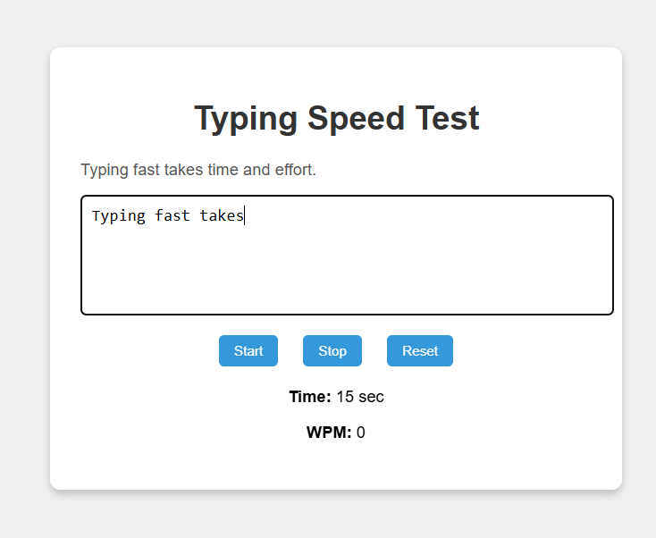
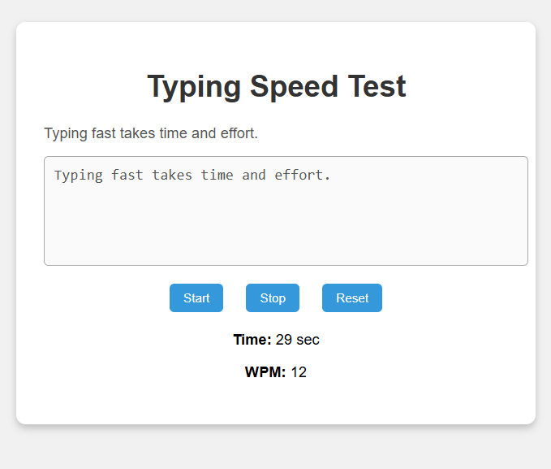

⌨️ Typing Speed Test

A beginner-friendly **Typing Speed Test** built using **HTML**, **CSS**, and **JavaScript**. This tool lets users check their typing speed (WPM) in real-time and includes `Start`, `Stop`, and `Reset` functionality. It's ideal for interns, students, and beginners to learn basic web development.



🚀 Features

- 📝 Random sentence generator
- ⏱️ Live timer
- 📊 Calculates **Words Per Minute (WPM)**
- 🛑 Stop button to check speed anytime
- 🔁 Reset to try again
- 🔓 Beginner-friendly codebase

🛠️ Technologies Used

- HTML5
- CSS3
- JavaScript

📁 Folder Structure

typing-speed-test/
│
├── index.html # Main webpage
├── style.css # Styling for the app
├── script.js # Typing speed logic and interactivity
└── README.md # Project documentation

📸 Screenshot




▶️ How to Run

1. **Clone or download the repository**
   ```bash
   git clone https://github.com/DONDAPATI-THEERDHA-PURUSHOTHAM/Typing-speed-writer.git
Open the project
Navigate to the project folder and open index.html in your browser.

Start Typing

Click Start to begin the test.

Type the sentence shown.

Click Stop anytime to calculate your WPM.

Click Reset to try again with a new sentence.

💡 Learning Outcomes
Using JavaScript timers (setInterval)

DOM manipulation (getElementById, addEventListener)

Handling user input in real time

Basic styling and layout with CSS

Logic for calculating WPM (Words Per Minute)


🔄 Future Improvements 

✅ Accuracy percentage calculation
✅ Mistake highlighting in input
🌙 Dark mode toggle
🏆 Leaderboard with local storage
🔠 Allow users to set custom sentences

🧑‍💻 Author
Dondapati Theerdha Purushotham 
📚 Engineering Student - AI & ML
🌐 Passionate about tech, law, and web development and creativity!

📄 License
This project is licensed under the MIT License. 

Contribution and support

Let me know if you'd like a my GitHub Pages deployment or want me to add more information to improve the project. Thank you.
